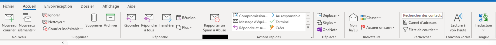
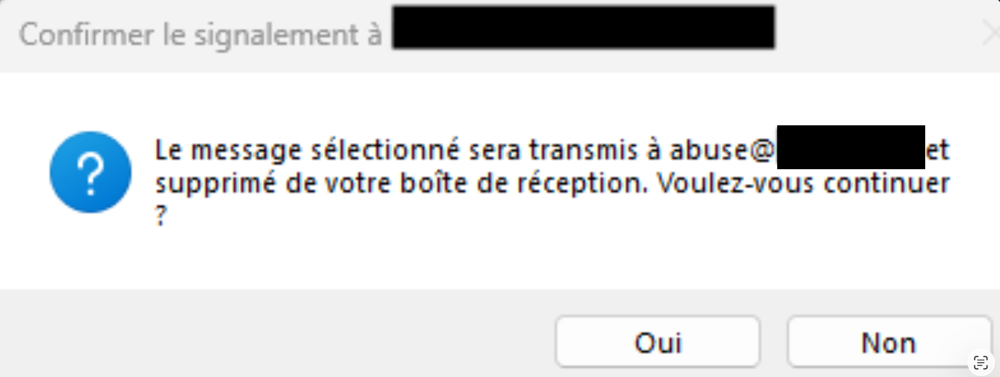
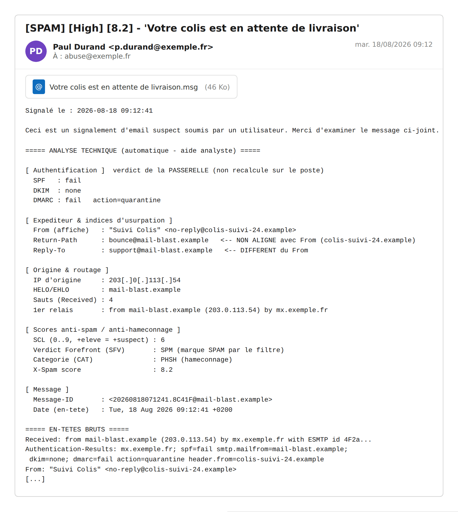
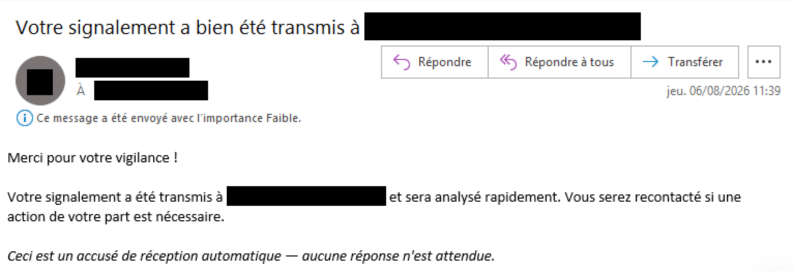
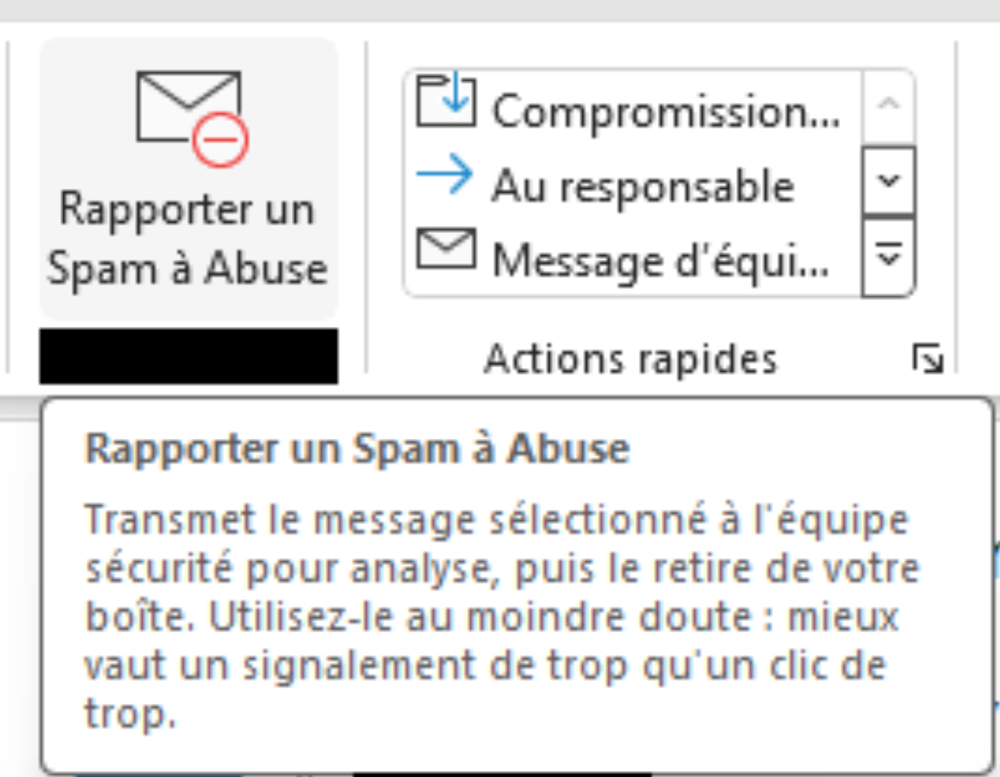
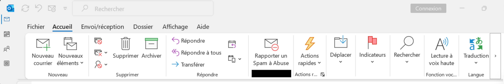

> **FR :** [Version française](README.fr.md)

# BoutonSPAM — suspicious email reporting for Outlook

> A **functional, fleet-deployable** fork of the open source milCERT
> [Outlook-Spam-Add-In](https://github.com/milcert/Outlook-Spam-Add-In) (MIT):
> centralised customisation (`branding.conf`), interactive assistant, signed
> MSI build chain, silent GPO/Intune deployment, and a **web add-in variant**
> for OWA / the new Outlook. Attributions: `CREDITS.md`.

This Outlook add-in lets your users report suspicious emails (spam /
phishing) in one click and shortens the delay between the report and its
analysis by your security team. Every reported email is assessed (content,
headers, attachments, sender…), attached to the report, then sent to your
abuse mailbox. **French / English** interface (auto-detected, English
fallback).

Two variants in this repository:

| Variant | Folder | Target |
|---|---|---|
| **Desktop add-in (VSTO)** | `OutlookSpamAddin/` + `setup/` | Outlook for Windows 2016+ (.NET 4.8, VS 2022, signed MSI) |
| **Web add-in** | `webaddin/` | OWA / new Outlook (manifest + internal HTTPS hosting) |

## Preview

| Confirmation before sending | Report received by the abuse mailbox |
|---|---|
|  |  |
| **Automatic acknowledgment to the user** | **Button and help tooltip (new Outlook)** |
|  |  |

**New Outlook ribbon**

*Real Outlook screenshots (classic and new Outlook), organisation-specific
areas redacted; the abuse report is an illustration built from the product's
real texts.*

## Quick start (desktop add-in)

On Windows, **PowerShell at the project root, Visual Studio closed**:

	# 1. Create your configuration copy (never edit the .example files)
	cp branding.conf.example branding.conf

	# 2. Customise: addresses, texts, identity (see CUSTOMIZATION.md)

	# 3. End-to-end interactive assistant: workstation, branding, certificate, signed MSI
	Set-ExecutionPolicy -Scope Process -ExecutionPolicy Bypass
	.\scripts\05_assistant.ps1

`.\scripts\04_build.ps1` does the same **without questions** once
`branding.conf` is ready. The full script chain is described in the header of
each file in `scripts/`.

## Features

- Report one or several emails (ribbon button or context menu)
- Attachment detection and categorisation, link counting
- Automatic prioritisation (newsletter, links, risky attachments, signature…)
- Warning when the sender looks internal (configurable regex)
- Automatic acknowledgment to the reporting user (per-workstation switch)
- Original email attached to the report, Windows event log entries
- **Fail-close**: no hardcoded recipient — without configuration, nothing is sent

## Priorities

|                                        | **Low** | **Medium** | **High** |
|:---------------------------------------|:-------:|:----------:|:--------:|
| no link and no attachment              |    X    |            |          |
| Newsletter detected (List-Unsubscribe) |    X    |            |          |
| 3 links or more                        |         |     X      |          |
| Attachment (.png, .css, .jpg, ...)     |         |     X      |          |
| 1–2 links (typical phishing pattern)   |         |            |    X     |
| Signed or encrypted email              |         |            |    X     |
| Attachment (doc, exe, ps, js, ...)     |         |            |    X     |
| Sender domain on the watched TLD       |         |            |    X     |

Rules are evaluated in this order and the last matching one wins: a
newsletter downgrades the report to Low even with a risky attachment, and
the TLD is only tested when no newsletter is detected. The watched
"national" TLD (`\.fr$` by default) is set in `Ribbon.vb`. The OWA web
add-in does not set a priority (desktop client feature).

## Per-workstation configuration (registry)

The essentials are set once per workstation — template provided
(`resources/RegistryConfig.reg`, kept in sync from `branding.conf`):

	Windows Registry Editor Version 5.00

	[HKEY_LOCAL_MACHINE\SOFTWARE\OutlookSpamAddin]
	"To"="abuse@mondomaine[.]fr"
	"Cc"="spam@mondomaine[.]fr"
	"FilterInternalMessages"=dword:00000001
	"Regex"="(@mondomaine\\.fr$|@.*\\.mondomaine\\.fr$)"
	"SendAcknowledgment"=dword:00000001

The `[.]` examples are deliberately inoperative: replace them with your real
addresses. Against Office's automatic disabling (startup > 1 s), use a
machine GPO
([ListOfManagedAddins](https://getadmx.com/?Category=Office2016&Policy=visio16.Office.Microsoft.Policies.Windows::L_ListOfManagedAddins))
with the **button label** = `1`, or the provided HKCU key
(`resources/DoNotDisableAddinList*.reg`).

## Fleet deployment (silent)

	msiexec /i "OutlookSpamAddin-<version>.msi" /qn /norestart ALLUSERS=1

The `deploy/` folder ships the **ADMX/ADML GPO template** (central
configuration + anti-disabling) and `install-silencieux.cmd` (MSI + registry,
usable as-is with SCCM/MECM, Intune or your fleet tool).

## Web add-in (OWA / new Outlook)

The `webaddin/` folder contains the manifest, the sources and a
configuration generator (`deploy.env` → `manifest.xml` + `config.json`,
fail-close if no recipient); hosting is on the internal HTTPS host of your
choice. Guide (French): `webaddin/README-DEPLOIEMENT.md`.

## Code signing

Set `CERT_THUMBPRINT` (and `TIMESTAMP_URL`) in `branding.conf`, then
`.\scripts\03_sign.ps1` (integrated into `04_build.ps1`/`05_assistant.ps1`).
Without a certificate, a self-signed **TEST** certificate is created
automatically — see `certs/README.md`.

## Portable archive

`./scripts/00_make-archive.sh` (Git Bash) produces a timestamped archive of
the project with a **SHA-256** fingerprint, offline Visual Studio layout
included. On the target workstation, extract to a **short root** (e.g.
`C:\OSA`): the Visual Studio installer rejects layout paths over 80
characters.

## Security

*Fail-close* sending, **Authenticode** verification of downloaded binaries,
random temporary file names, anti-**ReDoS** bound, **SHA-256** archives — a
per-version summary lives in `CHANGELOG.md`.

## Customisation

Every field to adapt to your organisation (both variants) is catalogued in
[`CUSTOMIZATION.md`](CUSTOMIZATION.md) ([français](PERSONNALISATION.md)).

## License

MIT — see `LICENSE.md` (© milCERT for the original project, © smarkoof for
the modifications). Attributions: `CREDITS.md`.
